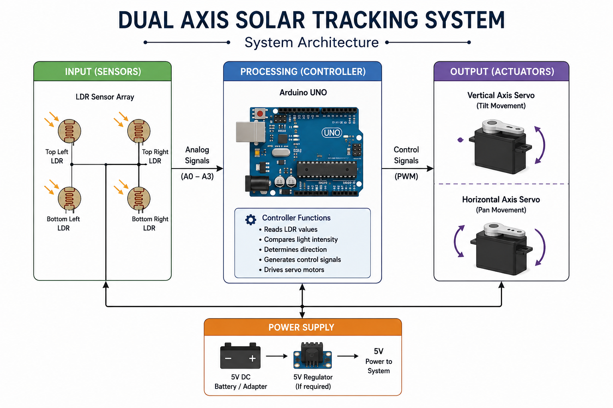
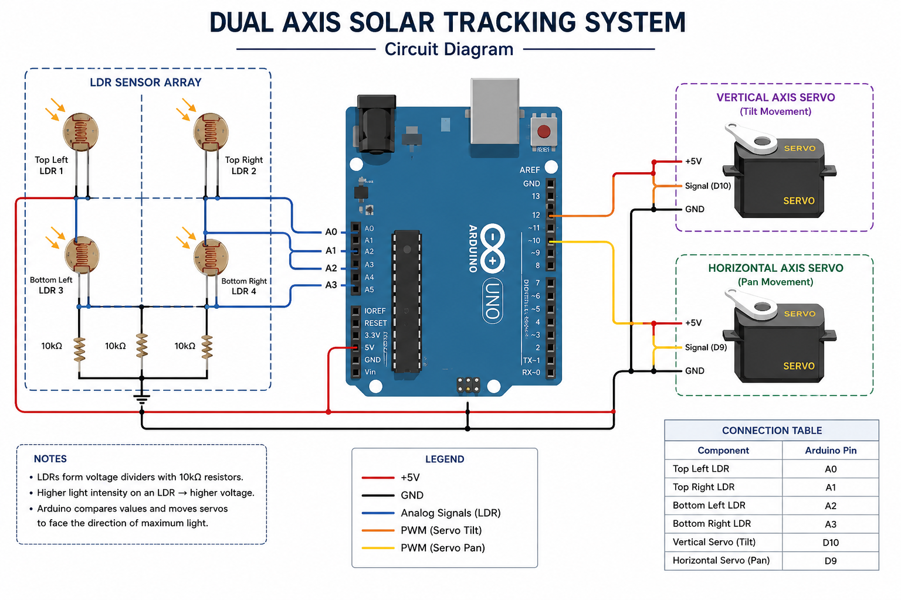

<h1 align="center">☀️ Solar Tracking System</h1>

<p align="center">
Arduino-based solar tracking system using LDR sensors and servo motors for automatic sunlight alignment.
</p>

<p align="center">
  
  <br></br>
  
    <br></br>
  
    <br></br>
  
</p>

---

# 📌 Overview

An Arduino-based dual-axis solar tracking system developed using LDR sensors and servo motors to automatically align a solar panel toward maximum sunlight intensity.

This project was developed as a 3rd semester academic hardware mini-project to explore:
- Embedded Systems
- Sensor Interfacing
- Servo Motor Control
- Renewable Energy Applications

---

## ✨ Features

- Real-time sunlight tracking
- Dual-axis panel movement
- Automatic solar alignment
- Arduino-based control system
- Low-cost prototype implementation

---

## 🛠️ Technologies & Components Used

### Hardware
- Arduino UNO
- LDR Sensors
- Servo Motors
- Solar Panel
- Resistors
- Breadboard
- Jumper Wires

### Software
- Arduino IDE
- Embedded C/C++
- Basic Electronics Design

---

## ⚙️ Working Principle

The system uses Light Dependent Resistors (LDRs) to detect sunlight intensity from different directions.

Based on the difference in light intensity values, the Arduino adjusts the servo motor positions to orient the solar panel toward the direction receiving maximum sunlight exposure.

This improves solar energy absorption efficiency compared to fixed-position panels.

---

## 🏗️ System Architecture



---

## 🔌 Circuit Diagram



> Diagram recreated for documentation purposes.

---
## Project Structure

```bash
dual-axis-solar-tracker/
│
├── README.md
├── images/
├── arduino-code/
├── circuit-diagram/
├── docs/
└── components/
```

---

##📚 Learning Outcomes

- Embedded systems fundamentals
- Sensor interfacing with Arduino
- Servo motor control
- Renewable energy concepts
- Hardware prototyping
- Circuit implementation and testing

---

##🚀 Future Improvements

- IoT monitoring dashboard
- OLED status display
- Battery efficiency monitoring
- Weather-resistant enclosure
- Automatic night reset mechanism

---

## 🔗 References

Project inspiration/reference:
https://youtu.be/YC4kIGQYld4

---

## Note

The original hardware prototype was developed during the 3rd semester.  
This repository serves as a documentation and implementation archive of the project.

## 👤 Author

**Nandan Kuchabal**
- GitHub: [@Nandanvk137](https://github.com/Nandanvk137)
- LinkedIn: [nandan-kuchabal](https://linkedin.com/in/nandan-kuchabal-404964361)

---
